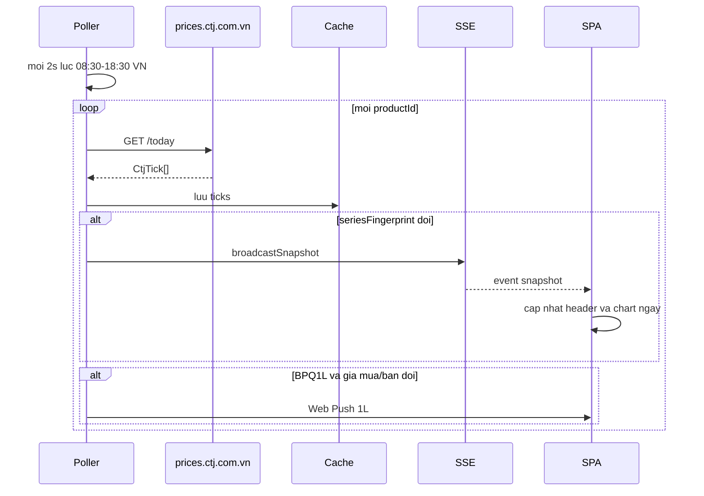
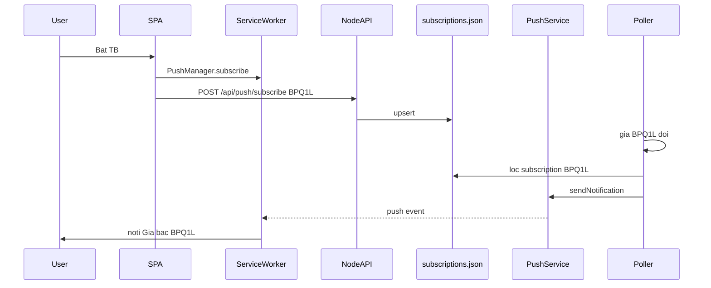
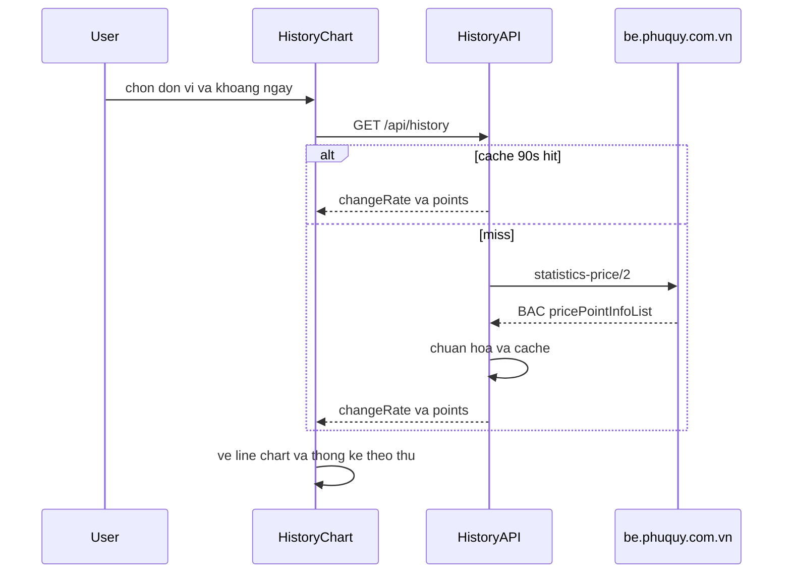
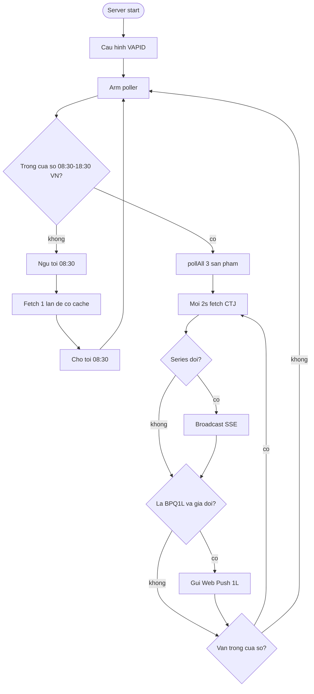
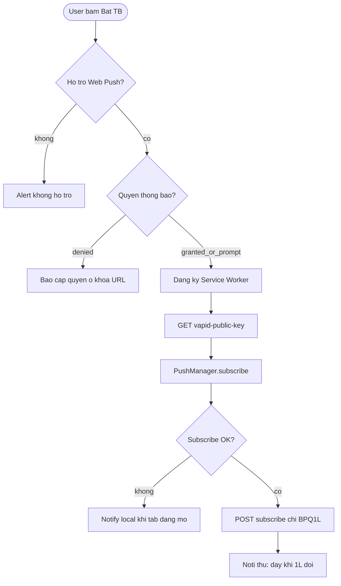

# Bạc Phú Quý Tracker

Theo dõi giá bạc Phú Quý (CTJ): chart trong ngày, quản lý vị thế, Web Push khi giá đổi.

**Kiến trúc:** chỉ server Node gọi CTJ và Phú Quý. SPA không poll public API — chỉ gọi `/api/*` (giá live SSE, lịch sử, Web Push).

- **Live:** poller cache ticks `BPQ1L` / `BPQ10L` / `BPQ1KG` → SSE `snapshot` → header + chart trong ngày + overlay vị thế
- **Lịch sử:** `GET /api/history` proxy Phú Quý (`statistics-price/2`), cache ~90s; UI Lượng/KG, 1D–1Y, thống kê theo thứ
- **Web Push:** chỉ khi giá **1L (`BPQ1L`)** đổi; subscription lưu `/var/lib/bacpq`
- **Vị thế:** `localStorage`, hoặc GitHub Gist khi đăng nhập

## Luồng hệ thống

### Sequence: giá live (CTJ → SSE)



### Sequence: Web Push 1L



### Sequence: biểu đồ lịch sử



### Activity: poller trong ngày



### Activity: bật thông báo



## Dev local

```bash
npm install
# Optional: VAPID cho Web Push
npx web-push generate-vapid-keys
export VAPID_PUBLIC_KEY=...
export VAPID_PRIVATE_KEY=...
export VAPID_SUBJECT=mailto:you@example.com

npm run dev
```

- Web (Vite): [http://localhost:5173](http://localhost:5173) (proxy `/api` → server)
- Server: [http://127.0.0.1:8787](http://127.0.0.1:8787)

Web Push trên Linux: dùng **Google Chrome** hoặc **Firefox**. Chromium/ungoogled/Brave thường báo `Registration failed - push service error` vì thiếu Google FCM. Brave: Settings → Privacy → bật *Use Google services for push messaging*.

## Production / VPS + Webinoly (`bac.codayroi.com`)

DNS: record **A** `bac.codayroi.com` → IP VPS. Webinoly đã cài sẵn. Trên Ubuntu (root):

Code app: `/var/www/bacpq` (Actions **tự clone** nếu chưa có). Repo phải **public**, hoặc trên VPS đã gắn deploy key để `git clone`/`pull` được.

Env: Secrets trên GitHub (`VAPID_*`, `VPS_*`) — không dùng `.env` trên VPS.

Cập nhật code: **push** `main` là đủ (GitHub Actions deploy). Chưa gắn Actions thì trên VPS:

```bash
sudo bash /var/www/bacpq/scripts/deploy.sh
```


### GitHub Actions (push `main` → build + deploy VPS)

Workflow: `.github/workflows/deploy-vps.yml` — CI `npm run build` trên GitHub, rồi SSH vào VPS chạy `deploy.sh`.

**1. SSH key (máy bạn hoặc GitHub):**

```bash
ssh-keygen -t ed25519 -C "github-actions-bacpq" -f ./bacpq-deploy -N ""
# public → VPS
ssh-copy-id -i ./bacpq-deploy.pub USER@VPS_IP
```

User SSH cần `sudo` không mật khẩu cho `deploy.sh` / `systemctl restart bacpq` (hoặc dùng `root`).

**2. Repo GitHub → Settings → Secrets and variables → Actions**


| Secret              | Ví dụ                                         |
| ------------------- | --------------------------------------------- |
| `VPS_HOST`          | IP VPS                                        |
| `VPS_USER`          | `root` hoặc user sudo                         |
| `VPS_SSH_KEY`       | private key `bacpq-deploy` (không passphrase) |
| `VPS_PORT`          | `22` (optional)                               |
| `VAPID_PUBLIC_KEY`  | từ `npx web-push generate-vapid-keys`         |
| `VAPID_PRIVATE_KEY` | cùng cặp                                      |
| `VAPID_SUBJECT`     | `mailto:you@example.com`                      |


Variables (optional): `PORT` (8787), `DATA_DIR` (`/var/lib/bacpq`), `POLL_MS` (2000).

Variable (optional): đổi path trên VPS thì sửa `cd /var/www/bacpq` trong workflow.

**3. Repo trên VPS phải** `git pull` **được** (public, hoặc [deploy key](https://docs.github.com/en/authentication/connecting-to-github-with-ssh/managing-deploy-keys) read-only nếu private).

Đổi branch: sửa `branches:` trong workflow (ví dụ `production`). `workflow_dispatch` cho phép bấm Deploy tay trên tab Actions.

- App: `127.0.0.1:8787` — Nginx reverse proxy + Let's Encrypt
- Subscriptions: `/var/lib/bacpq` (không xóa khi deploy)
- Log: `journalctl -u bacpq -f`

Example: bac.codayroi.com