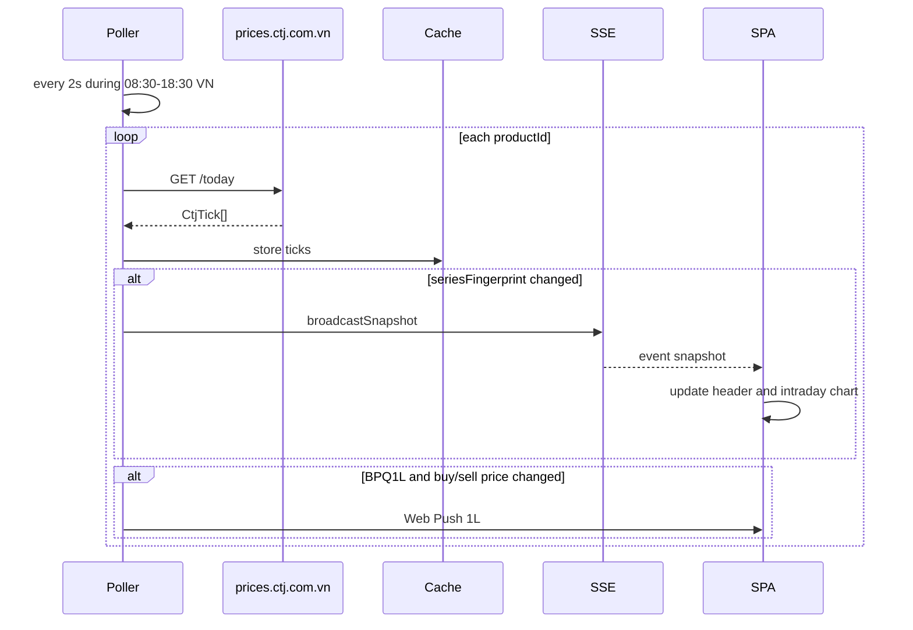
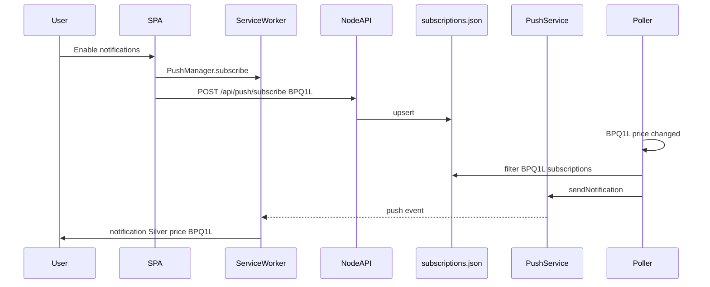
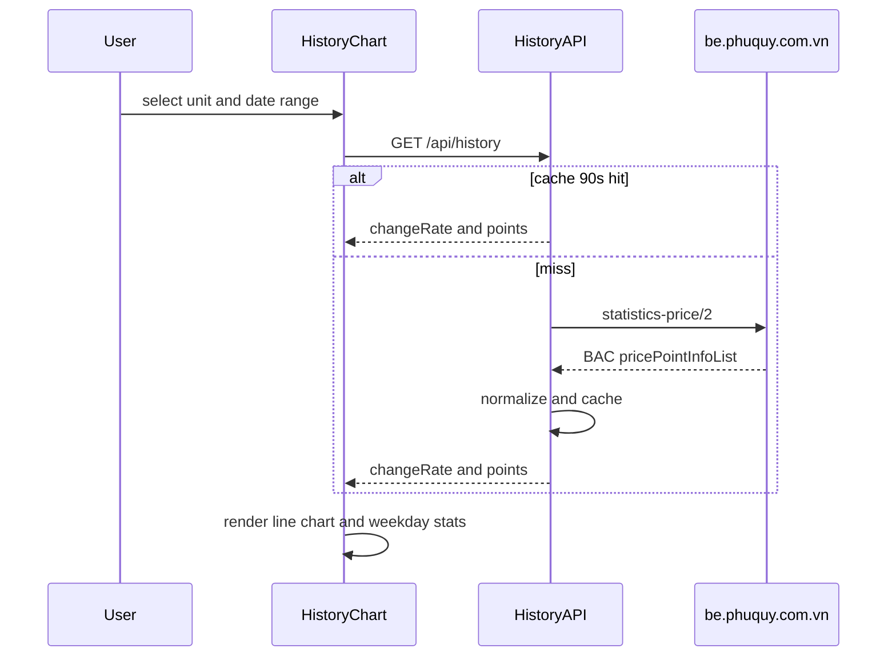
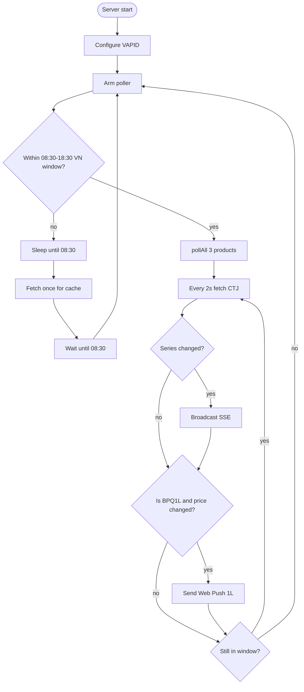
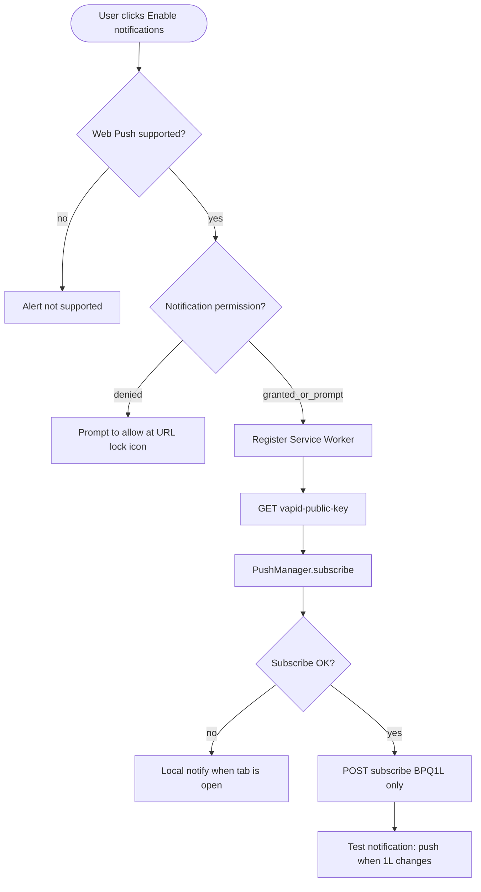

# Bạc Phú Quý Tracker

Track Phú Quý silver prices (CTJ): intraday chart, position management, Web Push on price changes.

**Architecture:** only the Node server calls CTJ and Phú Quý. The SPA never polls public APIs — it only calls `/api/*` (live prices via SSE, history, Web Push).

- **Live:** poller caches ticks for `BPQ1L` / `BPQ10L` / `BPQ1KG` → SSE `snapshot` → header + intraday chart + position overlays
- **History:** `GET /api/history` proxies Phú Quý (`statistics-price/2`), ~90s cache; UI supports Lượng/KG, 1D–1Y, weekday stats
- **Web Push:** only when **1L (`BPQ1L`)** price changes; subscriptions stored in `/var/lib/bacpq`
- **Positions:** `localStorage`, or GitHub Gist when signed in

> Vietnamese: [README-vi.md](README-vi.md)

## System flows

### Sequence: live prices (CTJ → SSE)



### Sequence: Web Push 1L



### Sequence: history chart



### Activity: intraday poller



### Activity: enable notifications



## Local development

```bash
npm install
# Optional: VAPID for Web Push
npx web-push generate-vapid-keys
export VAPID_PUBLIC_KEY=...
export VAPID_PRIVATE_KEY=...
export VAPID_SUBJECT=mailto:you@example.com

npm run dev
```

- Web (Vite): [http://localhost:5173](http://localhost:5173) (proxies `/api` → server)
- Server: [http://127.0.0.1:8787](http://127.0.0.1:8787)

Web Push on Linux: use **Google Chrome** or **Firefox**. Chromium/ungoogled/Brave often report `Registration failed - push service error` because Google FCM is missing. Brave: Settings → Privacy → enable *Use Google services for push messaging*.

## Production / VPS + Webinoly (`bac.codayroi.com`)

DNS: **A** record `bac.codayroi.com` → VPS IP. Webinoly is pre-installed. On Ubuntu (root):

App code: `/var/www/bacpq` (Actions **auto-clones** if missing). Repo must be **public**, or the VPS must have a deploy key for `git clone`/`pull`.

Env: GitHub Secrets (`VAPID_*`, `VPS_*`) — no `.env` on the VPS.

To deploy: **push** to `main` (GitHub Actions deploys). Without Actions, on the VPS:

```bash
sudo bash /var/www/bacpq/scripts/deploy.sh
```

### GitHub Actions (push `main` → build + deploy VPS)

Workflow: `.github/workflows/deploy-vps.yml` — CI runs `npm run build` on GitHub, then SSH to the VPS and runs `deploy.sh`.

**1. SSH key (your machine or GitHub):**

```bash
ssh-keygen -t ed25519 -C "github-actions-bacpq" -f ./bacpq-deploy -N ""
# public → VPS
ssh-copy-id -i ./bacpq-deploy.pub USER@VPS_IP
```

SSH user needs passwordless `sudo` for `deploy.sh` / `systemctl restart bacpq` (or use `root`).

**2. GitHub repo → Settings → Secrets and variables → Actions**

| Secret              | Example                                       |
| ------------------- | --------------------------------------------- |
| `VPS_HOST`          | VPS IP                                        |
| `VPS_USER`          | `root` or sudo user                           |
| `VPS_SSH_KEY`       | private key `bacpq-deploy` (no passphrase)    |
| `VPS_PORT`          | `22` (optional)                               |
| `VAPID_PUBLIC_KEY`  | from `npx web-push generate-vapid-keys`       |
| `VAPID_PRIVATE_KEY` | same key pair                                 |
| `VAPID_SUBJECT`     | `mailto:you@example.com`                      |

Variables (optional): `PORT` (8787), `DATA_DIR` (`/var/lib/bacpq`), `POLL_MS` (2000).

Variable (optional): to change the VPS path, edit `cd /var/www/bacpq` in the workflow.

**3. Repo on the VPS must support** `git pull` (public, or a read-only [deploy key](https://docs.github.com/en/authentication/connecting-to-github-with-ssh/managing-deploy-keys) if private).

Change branch: edit `branches:` in the workflow (e.g. `production`). `workflow_dispatch` allows manual Deploy from the Actions tab.

- App: `127.0.0.1:8787` — Nginx reverse proxy + Let's Encrypt
- Subscriptions: `/var/lib/bacpq` (not deleted on deploy)
- Logs: `journalctl -u bacpq -f`

Example: bac.codayroi.com
